# Configurable Reminding System
Group 1 - Configurable Reminding System and Track Record for ADD Orphanage

<h2>HOME</h2>
- This is the home page of the Web Application where the admin and staff are required to login to access the system. The home page contains the about us and the Activities.

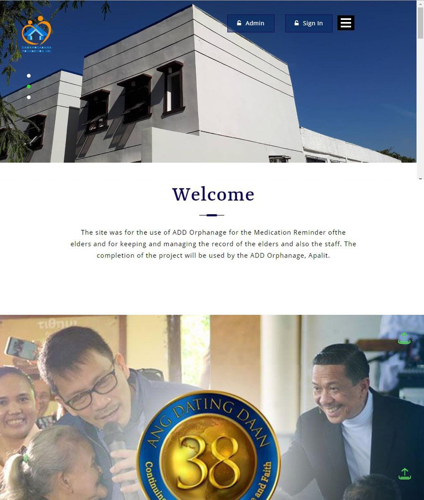

<h2>FOR ADMIN USE</h2>
- Admin account can view and update the Profile of the Elders and their medical history and the profile of the staff, it is also the one who is responsible to register the new elders or staff of ADD Orphanage.

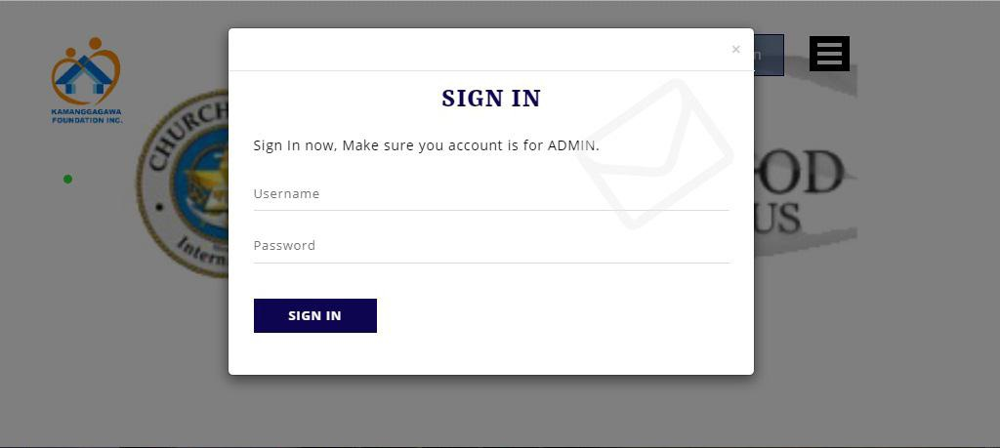

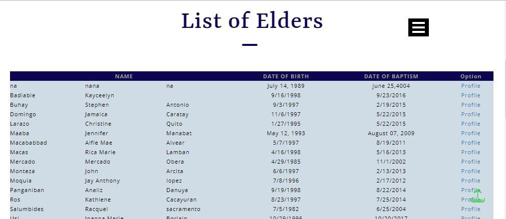

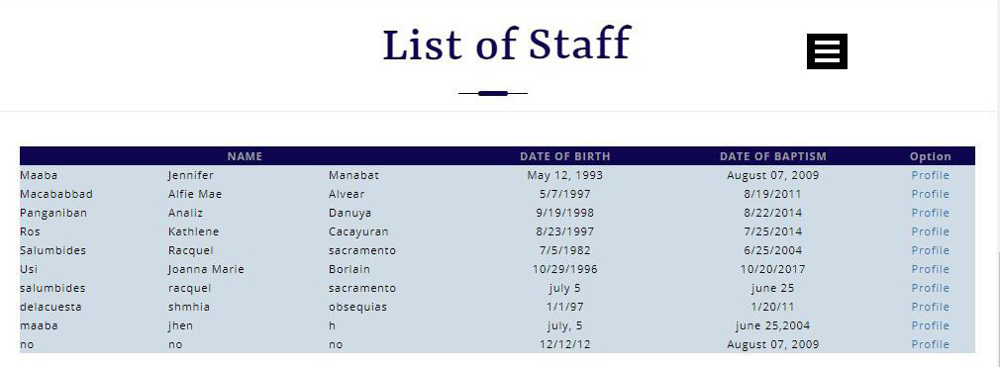

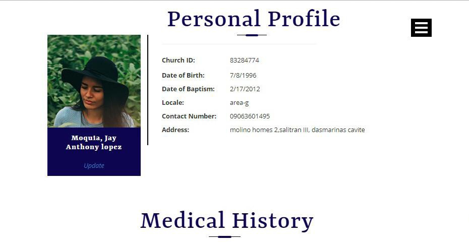

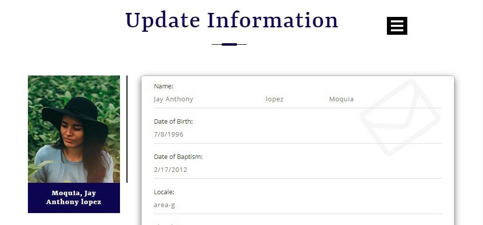

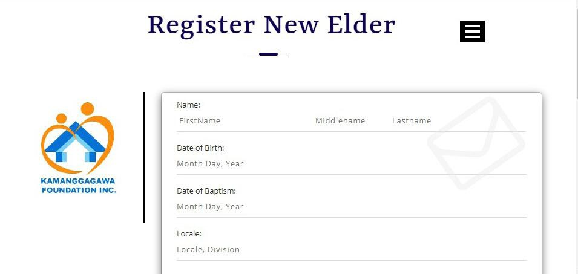

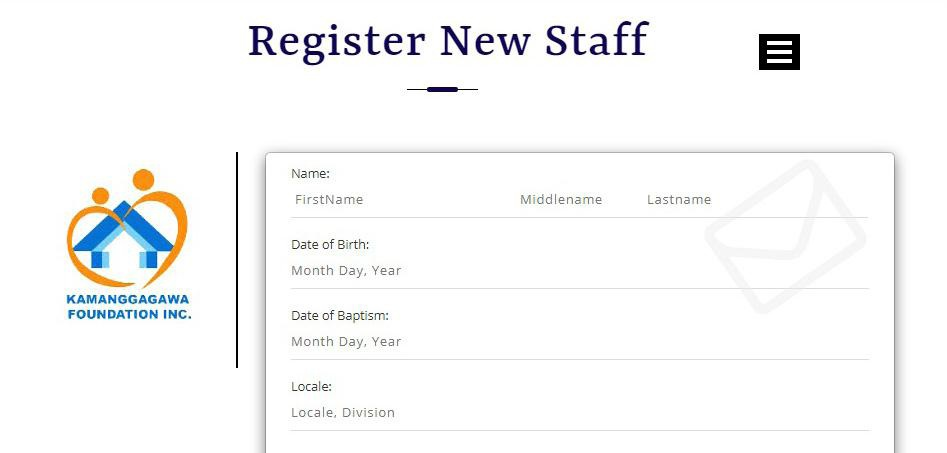

<h2>FOR STAFF/VOLUNTEER USE</h2>
- The Staff Account can only view the Elders Profile and their medical history, it is also the one who are responsible for encoding or scheduling the medicine intake by the elders.

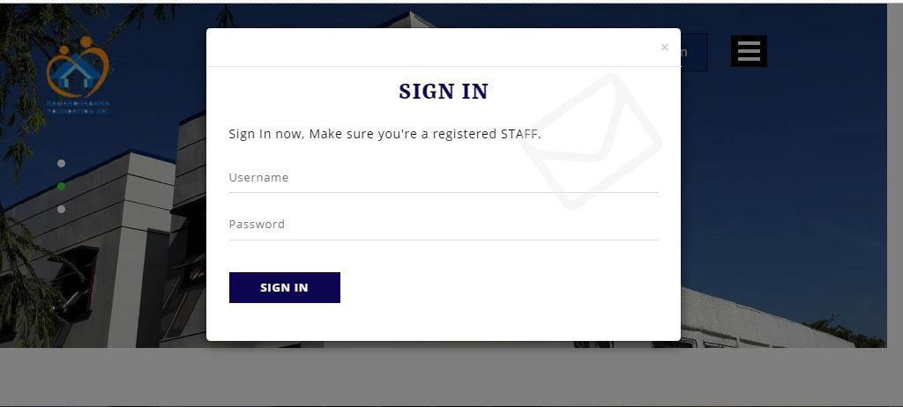

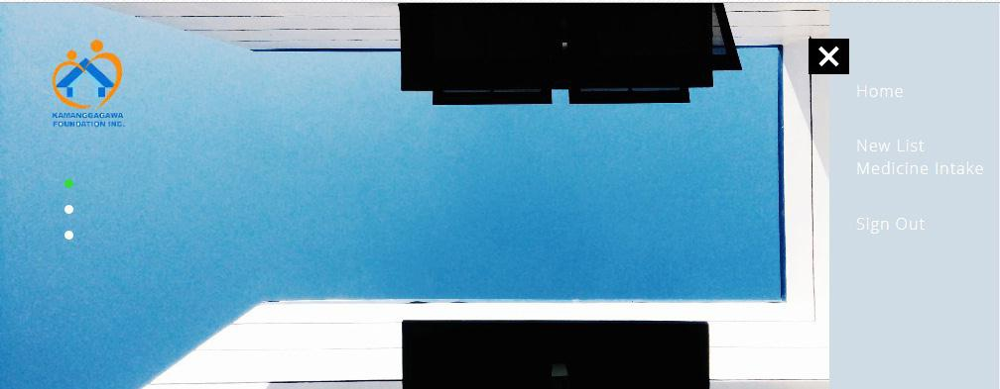

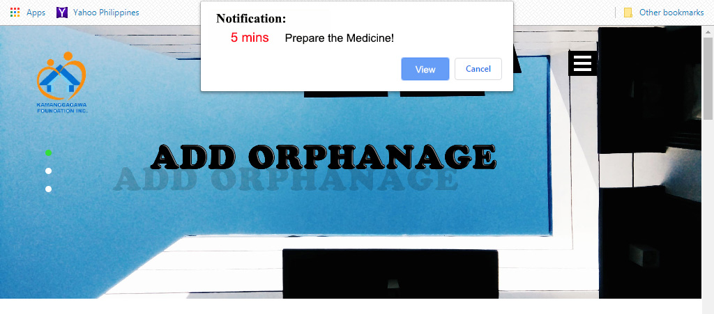

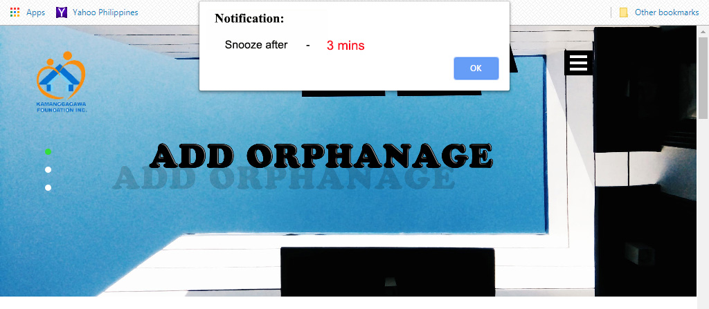

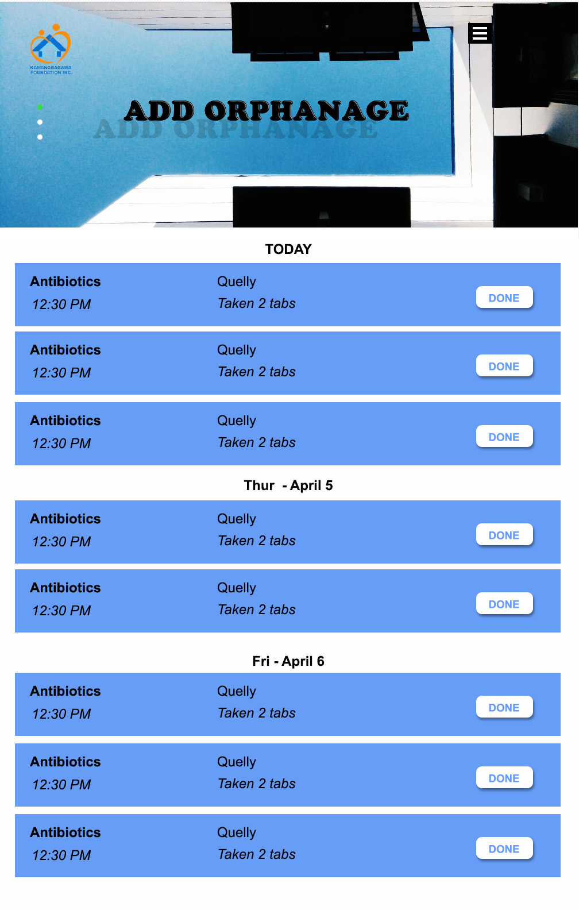
